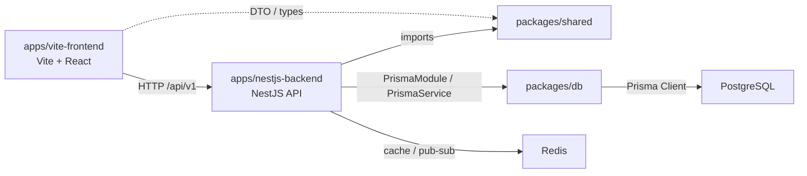

# Fullstack Vite Turborepo Starter

一个基于 `npm workspaces + Turborepo` 的全栈模板仓库：

- 前端：`Vite + React + TypeScript`
- 后端：`NestJS + Prisma`
- 共享层：`packages/shared` 维护 DTO / enum / 类型契约
- 数据层：`packages/db` 维护 Prisma schema、迁移和 Nest 可复用的 `PrismaModule`

根 README 是本仓库的主入口。`docs/`、`codemaps/` 和各 workspace README 只补充各自职责，不再重复整套项目说明。

> 仓库现状快照（验证日期：2026-04-04）
>
> - `npm run build` 可通过
> - `npm run test:unit` 可通过，当前包含后端健康检查单测
> - `npm run test:e2e` 可通过，当前包含后端 Jest E2E smoke test 和前端 Playwright smoke test
> - `npm run lint` 可通过，当前工作区可以作为干净基线

## 项目定位

这个模板适合用来启动一个“前后端分离但放在一个 monorepo 里统一维护”的项目：

- 前端通过 Vite 提供开发服务器和构建产物
- 后端用 NestJS 暴露 REST API
- Prisma 负责数据库 schema、客户端生成和迁移
- 共享 DTO 放在独立包里，避免前后端接口各写一份
- Turborepo 负责跨 workspace 的任务编排和缓存

它更偏向“工程化模板”，而不是一个已经完成业务抽象的产品框架。你会拿到一套清晰的分层和现成的登录链路，但仍需要补齐业务页面、测试资产和部署细节。

## 一图看懂架构



## 技术栈

| 层级     | 位置                  | 主要技术                                                                                                  |
| -------- | --------------------- | --------------------------------------------------------------------------------------------------------- |
| Frontend | `apps/vite-frontend`  | Vite、React 19、React Router、TanStack Query、Zod、React Hook Form、Tailwind CSS、Radix UI、react-i18next |
| Backend  | `apps/nestjs-backend` | NestJS 11、Prisma、PostgreSQL、Redis、Joi、Passport JWT、Swagger                                          |
| Shared   | `packages/shared`     | DTO、enum、共享类型定义                                                                                   |
| DB       | `packages/db`         | Prisma schema、迁移、生成的 Prisma Client、Nest 可复用 DB 封装                                            |
| Tooling  | repo root             | npm workspaces、Turborepo、Prettier、XO、Husky、Commitlint                                                |

## 仓库结构分析

### 根目录为什么这样组织

| 路径                                   | 作用                                             | 为什么放在这里                                   |
| -------------------------------------- | ------------------------------------------------ | ------------------------------------------------ |
| `package.json`                         | 根级脚本、workspace 声明、Node/npm 版本要求      | 让所有工作区共享一套入口命令                     |
| `turbo.json`                           | Turborepo 任务依赖与缓存配置                     | 把构建、lint、测试的编排逻辑集中在一个地方       |
| `docker-compose.yml`                   | 本地基础设施，只负责 Postgres/Redis              | 应用跑宿主机，数据库和缓存跑容器，开发体验更直接 |
| `.env.development` / `.env.production` | 当前项目实际使用的根级运行时配置                 | 后端和 Vite 都从根目录取环境变量                 |
| `docs/`                                | 贡献流程、运维/排障说明                          | 补充 README，不承载主入口职责                    |
| `codemaps/`                            | 面向维护者的结构速览                             | 用于快速理解各层职责和依赖边界                   |
| `deploy/`                              | 可选的容器化构建文件                             | 和日常开发解耦，不影响本地启动路径               |
| `scripts/`                             | 仓库辅助脚本，例如基础设施启动、初始化、同步脚本 | 把 shell 逻辑收敛到可维护的 Node 脚本里          |

### `apps/` 与 `packages/` 的职责边界

```text
apps/
  nestjs-backend/   NestJS API、鉴权、健康检查、用户模块
  vite-frontend/    Vite React 前端、路由、状态管理、表单、i18n
packages/
  db/               Prisma schema、迁移、PrismaService、PrismaModule
  shared/           LoginDto / RegisterDto / UserDto / UserRole 等共享契约
```

- `apps/` 放“可运行的应用”
- `packages/` 放“被多个应用消费的可复用能力”
- 当前边界是清晰的：前端不直接访问 Prisma，后端不复制 DTO，数据访问都收敛到 `packages/db`

## 新手快速上手

### 前置要求

- Node.js：仓库声明要求 `>=24.0.0`
- npm：仓库声明要求 `>=11.0.0`
- Docker Desktop 或可用的 Docker Engine
- 根目录提供 `.nvmrc`，当前固定版本为 `24.13.1`

> 注意：本地本次验证环境是 `Node v20.20.0 / npm 10.8.2`，`npm run build` 能跑通，但这不等于仓库正式支持该组合。安装兼容性仍以 `package.json` 里的 engine 要求为准。

### Happy Path

1. 安装依赖

```bash
npm install
```

2. 启动本地基础设施

```bash
npm run infra:start
npm run infra:health
```

3. 启动开发环境

```bash
npm run dev
```

4. 访问本地地址

- 前端首页：<http://localhost:3000>
- 后端健康检查：<http://localhost:4000/api/v1/health>
- Swagger：<http://localhost:4000/api/docs>（当 `ENABLE_SWAGGER=true` 时）

### 你需要理解的启动事实

- 当前仓库没有可直接复制的 `apps/*/.env.example`
- 默认开发配置已经放在根目录 `.env.development`
- `docker-compose.yml` 使用根目录 `.env` 作为可选覆盖；如果根目录没有 `.env`，就回退到 compose 里的默认值
- 只要 `.env.development` 里的 `DATABASE_URL` / `REDIS_URL` 与 Docker Compose 实际启动的端口和密码一致，默认开发链路就能工作

### 什么时候需要自己创建根级 `.env`

只有当你想覆盖 Docker Compose 默认端口或密码时，才需要在仓库根目录手动创建 `.env`，例如：

```dotenv
POSTGRES_PORT=55432
POSTGRES_DB=my_app
POSTGRES_USER=postgres
POSTGRES_PASSWORD=postgres
POSTGRES_TIMEZONE=UTC
REDIS_PORT=16379
REDIS_PASSWORD=redis_pass
```

如果你这样做了，记得同步修改根目录 `.env.development` 里的：

- `DATABASE_URL`
- `REDIS_URL`

否则容器和应用会连到不同的地址。

## 环境变量与配置策略

### 当前真实来源

| 文件               | 当前角色                    | 备注                                                    |
| ------------------ | --------------------------- | ------------------------------------------------------- |
| `.env.development` | 本地开发默认运行时配置      | 后端通过 `ConfigModule` 读取，Vite 也会从根目录读取 env |
| `.env.production`  | 生产示例配置                | 更像示例值，不应直接用于真实生产                        |
| `.env`             | Docker Compose 可选覆盖文件 | 主要影响 Postgres / Redis 的端口与凭据                  |

### 当前变量清单

| 变量                | 主要消费者                            | 当前状态       | 说明                                                                         |
| ------------------- | ------------------------------------- | -------------- | ---------------------------------------------------------------------------- |
| `NODE_ENV`          | NestJS                                | 已使用         | 决定读取 `.env.development` / `.env.production`，也影响 cookie `secure` 行为 |
| `PORT`              | NestJS                                | 已使用         | 控制后端监听端口，默认是 `4000`                                              |
| `ENABLE_SWAGGER`    | NestJS                                | 已使用         | 控制是否开启 Swagger UI                                                      |
| `DATABASE_URL`      | Prisma / NestJS                       | 已使用         | Prisma datasource 与后端数据库连接串                                         |
| `REDIS_URL`         | NestJS                                | 已使用         | Redis 优先使用完整 URL                                                       |
| `JWT_SECRET`        | NestJS Auth                           | 已使用         | JWT 签名密钥，长度需至少 32 个字符                                           |
| `FRONTEND_HOST`     | NestJS CORS                           | 已使用         | 当前优先读取 `FRONTEND_HOST`，并兼容旧的 `HOST` 作为回退来源                 |
| `VITE_BACKEND_URL`  | Frontend                              | 已使用         | 开发环境用于 Vite 代理目标，非开发环境用于前端 API client 计算后端基地址     |
| `POSTGRES_PORT`     | Docker Compose / Prisma fallback 配置 | 仅 Docker 覆盖 | 影响容器映射端口                                                             |
| `POSTGRES_DB`       | Docker Compose                        | 仅 Docker 覆盖 | 决定容器初始化数据库名                                                       |
| `POSTGRES_USER`     | Docker Compose                        | 仅 Docker 覆盖 | 决定容器数据库用户                                                           |
| `POSTGRES_PASSWORD` | Docker Compose                        | 仅 Docker 覆盖 | 决定容器数据库密码                                                           |
| `POSTGRES_TIMEZONE` | Docker Compose / Nest config          | 部分已使用     | 容器使用它设置时区，应用也声明了对应配置键                                   |
| `REDIS_PORT`        | Docker Compose                        | 仅 Docker 覆盖 | 控制 Redis 映射端口                                                          |
| `REDIS_PASSWORD`    | Docker Compose / Redis fallback 配置  | 已使用         | Redis URL 缺失时可走分散配置                                                 |

### 当前不应再照做的旧流程

以下文档心智在这个仓库里已经过时：

- “复制根目录和 `apps/*` 下的 `.env.example`”
- “前端通过 `NEXT_PUBLIC_*` 读取后端地址”
- “`npm run init` 是默认推荐上手方式”

这些说法来自旧文档和迁移残留，不符合当前代码实现。

## 开发命令速查

### 可直接使用

| 命令                   | 作用                                                         |
| ---------------------- | ------------------------------------------------------------ |
| `npm run infra:start`  | 启动本地 Postgres / Redis 容器                               |
| `npm run infra:health` | 查看基础设施容器状态                                         |
| `npm run infra:stop`   | 停止基础设施                                                 |
| `npm run infra:logs`   | 跟踪容器日志                                                 |
| `npm run dev`          | 并行启动前后端开发环境                                       |
| `npm run dev:all`      | 先起基础设施再启动开发环境                                   |
| `npm run build`        | 构建整个 monorepo；会先构建 `packages/db`、`packages/shared` |
| `npm run format`       | 对文档与静态文本资源执行 Prettier                            |
| `npm run start:dev`    | 按 workspace 的 `start:dev` 运行                             |
| `npm run start:prod`   | 按 workspace 的 `start:prod` 运行                            |

### 存在前提或当前缺口

| 命令                    | 当前状态               | 说明                                                                                                                  |
| ----------------------- | ---------------------- | --------------------------------------------------------------------------------------------------------------------- |
| `npm run lint`          | 受当前工作区脏文件影响 | 仓库里已有未提交的后端文件改动，当前不能把 lint 结果当成干净基线                                                      |
| `npm run lint:fix`      | 谨慎使用               | 会改写文件，不适合在你还没确认工作区状态时直接跑                                                                      |
| `npm run test:unit`     | 可直接使用             | 当前已接通后端健康检查单测                                                                                            |
| `npm run test:unit:cov` | 有前提但可用           | 基于同一套测试资产；本轮未单独重跑 coverage                                                                           |
| `npm run test:e2e`      | 可直接使用             | 当前已接通后端 Jest E2E smoke test 与前端 Playwright smoke test；首次运行前可能需要 `npx playwright install chromium` |
| `npm run init`          | 适合模板二次定制时使用 | 会重命名 workspace 包名、重写内部依赖，并生成可选的根级 `.env` Docker 覆盖模板                                        |
| `npm run copilot:sync`  | 仓库维护脚本           | 只在你明确知道它要同步什么时再用                                                                                      |

## 运行机制拆解

### 前端请求链路

- 前端 API 客户端在 `apps/vite-frontend/src/lib/axios.ts`
- `axiosInstance` 在开发环境下请求相对路径 `/api/v1`
- 非开发环境下，前端会基于 `VITE_BACKEND_URL` 计算 API 基地址
- Vite 开发代理同样会读取 `VITE_BACKEND_URL` 作为 `/api/v1` 的后端目标

### 后端启动链路

- `apps/nestjs-backend/src/main.ts` 注册了：
  - `helmet`
  - `compression`
  - 全局 `ValidationPipe`
  - 全局异常过滤器
  - CORS
  - 全局前缀 `/api/v1`
- Swagger 路径是 `/api/docs`
- 鉴权使用 JWT，来源优先级是：
  1. Cookie `access_token`
  2. Bearer Token

### 登录与用户态

- `POST /api/v1/auth/login` 和 `POST /api/v1/auth/register` 返回 `AuthResponseDto`
- 后端会把 JWT 同时写入响应体和 `httpOnly` cookie
- 前端通过 `useMe()` 调用 `GET /api/v1/users/me` 判断登录状态
- Axios 响应拦截器在遇到 `401` 时会清空 Zustand 中的用户态并重定向到登录页

### Shared DTO 契约

`packages/shared` 是前后端契约的单一来源。当前导出的核心对象包括：

| 导出项            | 用途            |
| ----------------- | --------------- |
| `LoginDto`        | 登录请求体      |
| `RegisterDto`     | 注册请求体      |
| `AuthResponseDto` | 登录/注册响应体 |
| `UserDto`         | 当前用户信息    |
| `UserRole`        | 用户角色 enum   |

### Prisma 数据层

- Prisma schema 在 `packages/db/prisma/schema.prisma`
- `packages/db` 暴露：
  - `PrismaClient`
  - `PrismaService`
  - `PrismaModule`
- 当前 schema 里真正参与业务的模型只有 `User`

## 当前 API 一览

| 方法   | 路径                    | 认证要求 | 返回                    | 说明                  |
| ------ | ----------------------- | -------- | ----------------------- | --------------------- |
| `POST` | `/api/v1/auth/register` | 否       | `AuthResponseDto`       | 注册并写入登录 cookie |
| `POST` | `/api/v1/auth/login`    | 否       | `AuthResponseDto`       | 登录并写入登录 cookie |
| `POST` | `/api/v1/auth/logout`   | 否       | `204 No Content`        | 清除登录 cookie       |
| `GET`  | `/api/v1/users/me`      | 是       | `UserDto`               | 获取当前登录用户      |
| `GET`  | `/api/v1/health`        | 否       | Terminus health payload | 检查数据库可用性      |

## 共享类型 / DTO 一览

| 类型              | 位置                                                 | 当前职责             |
| ----------------- | ---------------------------------------------------- | -------------------- |
| `LoginDto`        | `packages/shared/src/dtos/auth/login.dto.ts`         | 约束登录表单请求体   |
| `RegisterDto`     | `packages/shared/src/dtos/auth/register.dto.ts`      | 约束注册表单请求体   |
| `AuthResponseDto` | `packages/shared/src/dtos/auth/auth-response.dto.ts` | 登录/注册返回结构    |
| `UserDto`         | `packages/shared/src/dtos/user/user.dto.ts`          | 前后端共享的用户结构 |
| `UserRole`        | `packages/shared/src/enums/user-role.enum.ts`        | 角色枚举             |

## 当前可优化部分

### P0：应优先处理

| 问题                                                   | 影响                         | 证据                                                                  | 建议动作                                                                 |
| ------------------------------------------------------ | ---------------------------- | --------------------------------------------------------------------- | ------------------------------------------------------------------------ |
| 配置漂移：`FRONTEND_HOST` 与 `process.env.HOST` 不一致 | 自定义 CORS 来源可能不生效   | `apps/nestjs-backend/src/config/app.config.ts`                        | 统一配置键与 env 读取逻辑，并补回验证说明                                |
| 初始化流程漂移：`init` 依赖不存在的 `.env.example`     | 新手照文档执行会失败或被误导 | `scripts/init.js`                                                     | 修正脚本或移除复制逻辑，再决定是否恢复推荐入口                           |
| 测试资产缺失                                           | CI 与本地质量回归手段不完整  | `apps/nestjs-backend/package.json`、`apps/vite-frontend/package.json` | 至少补齐一个后端 Jest 单测、E2E 配置文件和一个前端 Playwright smoke test |

### P1：短期内应收敛

| 问题                                            | 影响                                   | 证据                                                                                    | 建议动作                                               |
| ----------------------------------------------- | -------------------------------------- | --------------------------------------------------------------------------------------- | ------------------------------------------------------ |
| UI 占位未完成：Header 无导航、Footer 链接无页面 | 首屏信息架构不完整，点击后直接进入 404 | `apps/vite-frontend/src/components/header/header.component.tsx`、`footer.component.tsx` | 明确导航需求并补齐最小可用页面或移除假链接             |
| 文档漂移                                        | 新成员很难判断哪份说明可信             | 旧版 `docs/`、`codemaps/`、workspace README                                             | 继续坚持“根 README 为事实入口”，其余文档只保留局部补充 |

### P2：可作为下一轮工程治理

| 问题                          | 影响                                 | 证据                                                                               | 建议动作                                                          |
| ----------------------------- | ------------------------------------ | ---------------------------------------------------------------------------------- | ----------------------------------------------------------------- |
| 前端迁移残留较多              | 容易混淆“当前实现”与“历史背景”       | `docs/archive/frontend-migration/MIGRATION-SUMMARY.md`、多个 `'use client'` 文件头 | 把迁移说明降级为历史资料，并清理不再有语义价值的残留              |
| `turbo.json` 环境依赖声明偏弱 | 环境变更未必能触发所有需要的缓存失效 | `turbo.json` 的 `globalDependencies` 仅包含 `**/.env.*local`                       | 补上根级 `.env.development`、`.env.production`、`.env` 等真实依赖 |

## 已知问题与限制

- 当前前端有效页面只有：首页、登录页、注册页、错误页、404 页
- `Header` 仍是占位组件，未形成真实导航
- `Footer` 包含 `/about`、`/contact`、`/privacy` 等链接，但路由并不存在
- `docs/archive/frontend-migration/MIGRATION-SUMMARY.md` 与 `docs/archive/frontend-migration/MIGRATION-TEST-RESULTS.md` 是历史迁移记录，不应视为当前状态文档
- 后端 `readme.md`、前端 README、`codemaps/` 在本次更新前存在明显过时信息，后续也要避免再次多处平行维护同一事实

## 延伸阅读

- 贡献流程：[docs/CONTRIB.md](./docs/CONTRIB.md)
- 运维与排障：[docs/RUNBOOK.md](./docs/RUNBOOK.md)
- 架构速览：[codemaps/architecture.md](./codemaps/architecture.md)
- Frontend codemap：[codemaps/frontend.md](./codemaps/frontend.md)
- Backend codemap：[codemaps/backend.md](./codemaps/backend.md)
- Data codemap：[codemaps/data.md](./codemaps/data.md)
- Frontend workspace：[apps/vite-frontend/README.md](./apps/vite-frontend/README.md)
- Backend workspace：[apps/nestjs-backend/readme.md](./apps/nestjs-backend/readme.md)
- Shared package：[packages/shared/README.md](./packages/shared/README.md)
- DB package：[packages/db/README.md](./packages/db/README.md)

## License

MIT - [LICENSE](./LICENSE)
