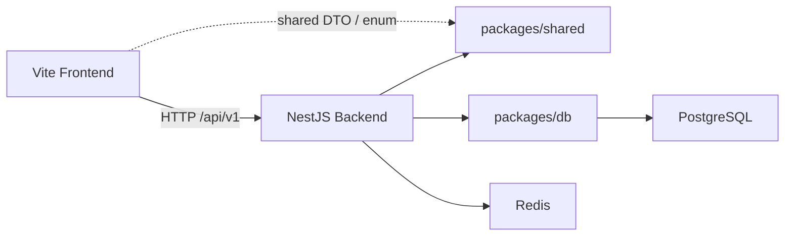

# Architecture

**Updated:** 2026-04-04

## Overview

这是一个标准的 Turborepo monorepo，但职责边界比较明确：

```text
apps/
  nestjs-backend/   NestJS API、鉴权、健康检查、用户模块
  vite-frontend/    Vite React 前端、页面路由、状态管理、i18n
packages/
  db/               Prisma schema、迁移、PrismaService、PrismaModule
  shared/           DTO、enum、共享类型
```

## Runtime Topology



## Key Dependencies by Layer

- Root
  - `turbo`
  - `husky`
  - `prettier`
  - `commitlint`
- Frontend
  - `vite`
  - `react`
  - `react-router-dom`
  - `@tanstack/react-query`
  - `react-hook-form`
  - `zod`
  - `react-i18next`
  - `zustand`
- Backend
  - `@nestjs/*`
  - `@nestjs/swagger`
  - `@nestjs/throttler`
  - `passport-jwt`
  - `ioredis`
  - `helmet`
  - `cookie-parser`
- Shared
  - `class-validator`
  - `class-transformer`
  - `@nestjs/swagger`
- DB
  - `prisma`
  - `@prisma/client`

## Cross-App Contracts

- 前端 API base URL：`/api/v1`
- Vite 开发代理：`/api/v1 -> http://localhost:4000`
- 后端全局前缀：`/api/v1`
- Swagger：`/api/docs`
- 鉴权方式：JWT，支持 cookie 与 Bearer Token

## Build and Task Graph

- 根命令入口全部来自 `package.json`
- `turbo.json` 当前声明的主要任务：
  - `build`
  - `db:generate`
  - `dev`
  - `start:dev`
  - `start:prod`
  - `lint`
  - `lint:fix`
  - `format`
  - `test:unit`
  - `test:unit:cov`
  - `test:e2e`
- 构建输出：
  - `apps/nestjs-backend/dist`
  - `apps/vite-frontend/dist`
  - `packages/shared/dist`
  - `packages/db/dist`
  - `node_modules/.prisma/client`

## Operational Notes

- Docker 仅用于本地基础设施，不承载应用本身
- 运行时环境变量当前来自根目录 `.env.development` / `.env.production`
- `turbo.json` 的环境依赖声明尚未完整覆盖这些根级 env 文件，是后续可优化项
